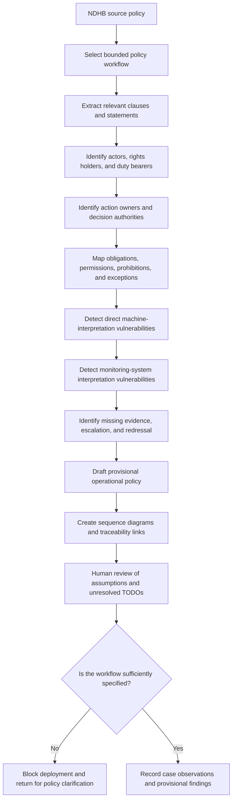

# Case 001: National Digital Health Blueprint

## Case purpose

This case applies the Two-Set Policy framework to selected parts of India’s National Digital Health Blueprint.

The case is intended to test whether a detailed human-readable policy and architecture document provides enough operational clarity for implementation by software systems, monitoring systems, and AI agents.

It is not an official interpretation of the Blueprint.

## Why this case was selected

The National Digital Health Blueprint is a useful first case because it combines:

- policy objectives
- institutional roles
- digital architecture
- interoperability requirements
- consent management
- privacy and security expectations
- analytics and monitoring
- implementation guidance

At the same time, several operational questions remain open or require further policy definition.

This makes it suitable for studying the gap between:

1. policy written for human interpretation
2. policy required for system implementation and enforcement

## Initial analysis scope

The first phase will focus on selected workflows:

- consented health-record sharing
- withdrawal of consent
- emergency or break-glass access
- patient identity uncertainty
- research and analytics access
- monitoring and alert generation
- record correction
- grievance and redressal
## Case workflow

## Planned case outputs

The case will progressively include:

- structured policy extraction
- actor and authority map
- permissions and obligations register
- direct machine-interpretation vulnerability register
- monitoring-system interpretation vulnerability register
- implementation sequence diagrams
- redressal and escalation model
- provisional operational policy JSON
- unresolved TODO register
- source traceability matrix

## Analytical questions

The case will examine:

- Which policy statements are sufficiently clear for implementation?
- Which statements require thresholds or evidence definitions?
- Which actions require named human authority?
- Which provisions should not be automated?
- What monitoring signals may be misinterpreted?
- What redressal path is available to affected individuals?
- Which unresolved questions should block deployment?

## Current status

Status: Early exploratory case

The analysis is provisional, incomplete, and subject to independent review.

No artefact in this case should be treated as legally authoritative, implementation-ready, or suitable for production enforcement.
