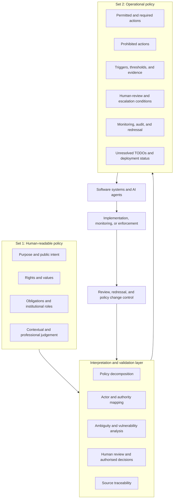

# Two-Set Policy

## Working proposition

Policies are usually written for human interpretation.

They communicate purpose, values, obligations, rights, institutional roles, and expected outcomes. They are interpreted by policymakers, regulators, administrators, legal professionals, service providers, and citizens.

When software systems or AI agents are expected to implement, monitor, or enforce the same policy, the human-readable document may not provide enough operational precision.

Two-Set Policy proposes two complementary policy layers.

## Set 1: Human-readable policy

The first policy set is designed for:

- democratic deliberation
- public communication
- legal interpretation
- institutional guidance
- contextual judgement
- expression of rights and values

It may contain principles such as fairness, meaningful oversight, proportionality, inclusion, accountability, and citizen control.

## Set 2: Operational policy

The second policy set is designed to guide and constrain software systems, workflows, monitoring systems, and AI agents.

It should define:

- permitted actions
- required actions
- prohibited actions
- action triggers
- required evidence
- action owners
- decision authorities
- human-review conditions
- exception handling
- escalation paths
- monitoring requirements
- notification duties
- redressal mechanisms
- audit requirements
- change-control authority
- unresolved policy dependencies
## Two-Set architecture

## Relationship between the two sets

The operational policy does not replace the human-readable policy.

It must remain:

- traceable to the source policy
- subordinate to authorised policy intent
- reviewable by humans
- attributable to accountable decision-makers
- open to challenge and revision
- explicit about uncertainty
- blocked from deployment where critical questions remain unresolved

## Central research question

Who is authorised to convert human policy language into operational instructions for software systems and AI agents, and how can those choices be made visible, traceable, contestable, and reviewable?

## Current project status

This is an early and evolving research framework.

The terminology, policy models, classifications, schemas, and case analyses are provisional and require independent review.

The project does not claim that all policy provisions should be machine-executable. In some cases, the appropriate operational rule may be that automation is prohibited and authorised human judgement is required.

## Initial direction

The framework will initially explore:

1. structured extraction of policy content
2. actor and authority identification
3. interpretation-vulnerability analysis
4. monitoring-system vulnerability analysis
5. operational sequence modelling
6. redressal and escalation design
7. operational policy representation
8. source traceability
9. unresolved-question management
10. policy change control

The National Digital Health Blueprint of India will be used as the first exploratory case.
