# Framework Overview

## Purpose

Two-Set Policy is a generic framework for creating and governing an operational policy layer for software systems and AI agents.

The framework begins with an existing human-readable policy, identifies where interpretation is required for implementation, and produces structured operational artefacts that remain traceable to the source policy.

The framework does not assume that every policy provision should become executable. Some provisions may require human judgement, institutional approval, public deliberation, or an explicit prohibition on automation.

## The two policy sets

### Set 1: Human-readable policy

The human-readable policy communicates:

- public purpose
- legal and institutional intent
- rights and responsibilities
- principles and values
- expected outcomes
- contextual standards
- institutional authority

### Set 2: Operational policy

The operational policy defines:

- permitted system actions
- required system actions
- prohibited system actions
- action triggers
- required inputs and evidence
- action owners
- decision authorities
- human-review conditions
- escalation paths
- exception handling
- notifications
- monitoring requirements
- redressal routes
- audit evidence
- expiry and review conditions
- change-control authority
- unresolved dependencies

## Framework lifecycle

The framework currently proposes five stages.
## Framework workflow

```mermaid
flowchart LR
    A[Source policy] --> B[Ingest]
    B --> C[Decompose]
    C --> D[Identify actors and rights holders]
    D --> E[Identify obligations, permissions, and prohibitions]
    E --> F[Identify owners and decision authorities]
    F --> G[Interrogate ambiguity and interpretation risk]
    G --> H[Draft operational policy]
    H --> I[Validate source traceability]
    I --> J[Check evidence, redressal, and escalation]
    J --> K[Flag unresolved TODOs]
    K --> L[Human review and authorised decision]
    L --> M{Release decision}
    M -->|Approve| N[Operational policy version]
    M -->|Revise| G
    M -->|Block| O[Deployment blocked]
    N --> P[Monitoring and implementation]
    P --> Q[Review, redressal, and change control]
    Q --> G
```

### 1. Ingest

The source policy is reviewed as a complete document.

A policy context record captures:

- title
- purpose
- scope
- jurisdiction
- legal status
- policy owner
- affected groups
- stated outcomes
- source references

### 2. Decompose

The policy is analysed to identify:

- actors
- rights holders
- duty bearers
- authorities
- obligations
- permissions
- prohibitions
- triggers
- thresholds
- evidence requirements
- exceptions
- monitoring duties
- redressal provisions
- change authority

### 3. Interrogate

Statements that cannot be implemented safely without interpretation become structured questions.

The questions may concern:

- definitions
- thresholds
- authority
- evidence
- procedures
- exceptions
- normative choices
- monitoring
- redressal
- change control

The framework should distinguish between:

- content extracted directly from policy
- system-generated inference
- human reviewer interpretation
- authorised institutional decision
- unresolved question

### 4. Validate

Proposed operational interpretations are checked for:

- completeness
- internal contradiction
- contradiction with source policy
- missing authority
- missing evidence
- missing redressal
- missing escalation
- secondary interpretation gaps
- unresolved deployment-critical issues

### 5. Translate

Validated decisions are represented as structured operational policy.

The output may include:

- JSON
- JSON Schema
- decision tables
- sequence diagrams
- actor and authority maps
- vulnerability registers
- traceability matrices
- unresolved TODO registers

## Core analytical dimensions

The initial framework will examine five dimensions.

### Functional interpretation

What process, action, or outcome does the policy require?

### Technical interpretation

What system behaviour, data, interfaces, rules, and controls are needed?

### Operational interpretation

Who performs the action, under what conditions, using what evidence, and with what escalation?

### Governance interpretation

Who has authority to approve, override, review, or change the operational rule?

### Redressal interpretation

How can an affected person challenge, correct, appeal, or seek remedy for an action?

## Mandatory operational rule fields

A mature operational rule should identify:

- source policy reference
- rule identifier
- jurisdiction
- scope
- trigger
- required inputs
- evidence standard
- action
- action owner
- decision authority
- permitted actions
- prohibited actions
- human-review requirement
- exception handling
- escalation path
- notification duty
- monitoring requirement
- redressal owner
- appeal path
- audit evidence
- effective date
- expiry or review date
- change authority
- unresolved TODOs
- deployment status

## Action ownership model

The framework should distinguish among:

- initiating actor
- affected person
- system actor
- action owner
- approving authority
- oversight authority
- monitoring owner
- redressal owner
- appeal authority
- change authority

These roles may belong to different institutions and must not be silently collapsed into one system or administrator.

## Machine-interpretation vulnerability analysis

The framework evaluates how a system might misinterpret policy when:

- a term is undefined
- a threshold is missing
- an authority is unnamed
- evidence is unspecified
- an exception is broad
- monitoring is treated as proof of compliance
- a value term is converted into a technical default
- redressal is absent
- a temporary rule has no expiry
- a system treats a registry or score as infallible

## Monitoring-system vulnerability analysis

The framework separately evaluates risks created by policy-monitoring systems.

Examples include:

- logs treated as proof of legitimacy
- consent counts treated as proof of meaningful consent
- anomaly detection treated as proof of misconduct
- performance indicators treated as proof of public value
- incomplete data treated as negative performance
- automated alerts treated as final decisions
- technical conformance treated as legal compliance
- outdated policy versions remaining active

## Redressal as a required component

Redressal should not be treated as an optional note.

For high-impact actions, the operational policy should identify:

- grievance owner
- complaint channel
- acknowledgement requirement
- response time
- evidence available to the affected person
- correction mechanism
- independent review
- appeal authority
- remedy or compensation where applicable
- closure criteria
- audit record

## Non-automatable provisions

A valid operational policy may conclude that a provision must not be automated.

Possible reasons include:

- contextual legal judgement
- unresolved normative conflict
- lack of authorised threshold
- insufficient evidence
- high-impact rights decision
- disputed authority
- need for public deliberation
- inability to provide effective redressal

## Deployment blocking

An unresolved question should block deployment when it affects:

- legality
- safety
- rights
- authority
- evidence sufficiency
- redressal
- high-impact decision-making
- emergency powers
- prohibited system behaviour

## Current maturity

The framework is at an early research stage.

The current structure is provisional and will be refined through:

- policy case studies
- cross-domain comparison
- independent review
- disagreement analysis
- schema validation
- technical prototyping
- empirical evaluation
